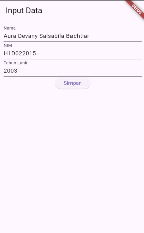

# Tugas Pertemuan 2

Nama : Aura Devany Salsabila Bachtiar

NIM : H1D022015

Shift Baru: Shift C

### Passing Data dari Form Menuju Tampilan dalam Flutter
Aplikasi ini terdiri dari dua layar, yaitu Form Input Data dan Tampil Data. Data yang diinputkan pada form akan dikirim ke halaman lain untuk ditampilkan. Berikut adalah proses detail bagaimana data dipassing dari form menuju tampilan:

1. Pengisian Data di Form (file form_data.dart)
Form terdiri dari tiga TextField untuk menerima input dari pengguna, yaitu:
a. Nama yang disimpan di _namaController.
b. NIM yang disimpan di _nimController.
c. Tahun Lahir yang disimpan di _tahunController.
Setiap input akan diambil dari TextEditingController yang terkait dengan masing-masing TextField tersebut.

2. Aksi Tombol "Simpan"
Setelah pengguna mengisi form, metode _tombolSimpan() akan memicu fungsi yang mengambil data dari controller. Berikut langkah-langkahnya:
a. Mengambil teks dari setiap TextField (seperti _namaController.text).
b. Tahun lahir dikonversi dari string ke integer (int.parse).
c. Setelah semua data diambil, Navigator.of(context).push() dipanggil untuk berpindah ke halaman baru (TampilData), sekaligus mengirimkan data yang telah diisi melalui konstruktor TampilData.

3. Passing Data ke Halaman Tampil Data (file tampil_data.dart)
Data dari form (nama, NIM, dan tahun lahir) dikirim ke halaman Tampil Data menggunakan Navigator dengan metode push dengan membuat halaman baru menggunakan MaterialPageRoute yang membangun objek TampilData.
Pada halaman Tampil Data, data tersebut diterima melalui konstruktor kelas TampilData, dan digunakan untuk ditampilkan di layar.

4. Menampilkan Data di Halaman Tampil Data
Pada tampil_data.dart, kelas TampilData menerima data nama, nim, dan tahun melalui konstruktor dan menyimpannya di properti final. Di dalam widget build(), data ini digunakan untuk menghitung umur berdasarkan tahun lahir dan ditampilkan di layar menggunakan widget Text dalam sebuah Column.
Data nama, nim, tahun, dan umur (hasil perhitungan dari DateTime.now().year - tahun) ditampilkan dengan menggunakan metode buildRow yang menampilkan teks dalam format berbaris.

### Kesimpulan
Proses passing data dari form ke tampilan dalam aplikasi ini berjalan sebagai berikut:
1. Data diisi oleh pengguna di halaman form (FormData).
2. Data dikirim ke halaman berikutnya (TampilData) melalui Navigator dan konstruktor.
3. Data ditampilkan di halaman TampilData, termasuk perhitungan umur.

## Screenshot

